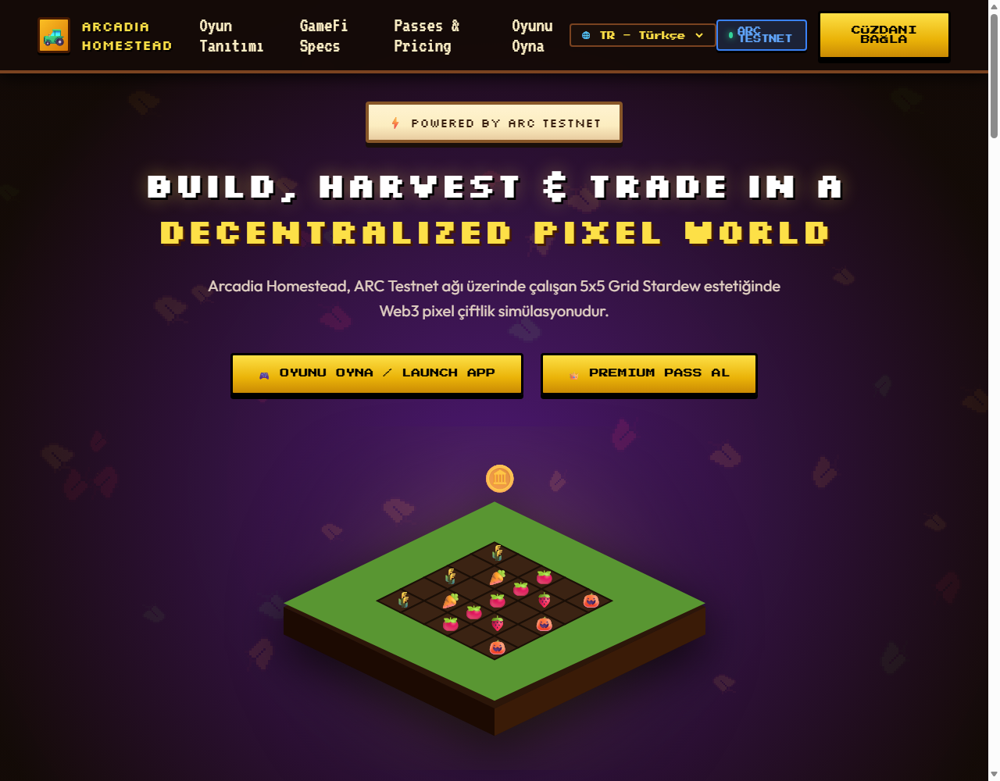
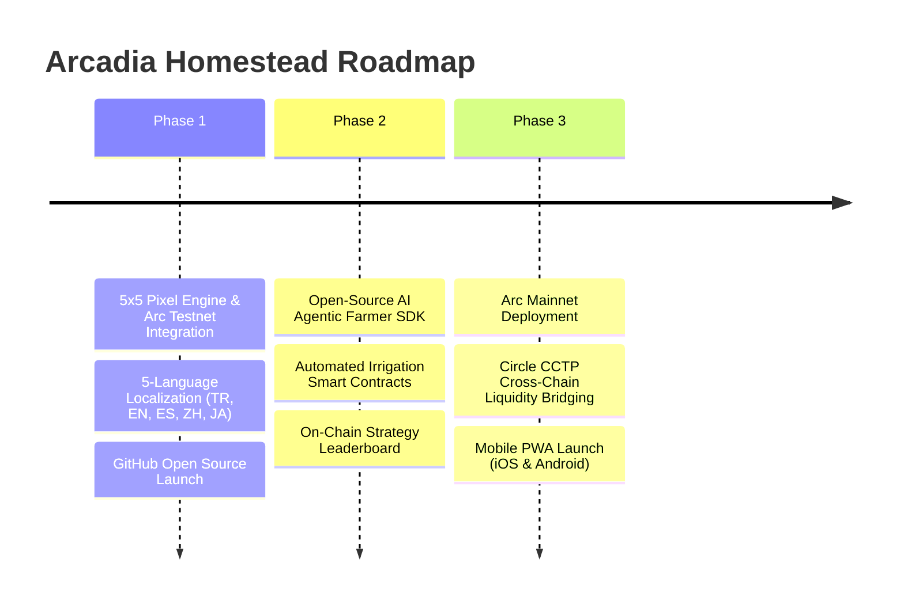

# 🌾 Arcadia Homestead - Web3 GameFi Pitch Deck

> **Track:** DeFi & Agentic Economy  
> **Blockchain:** Circle Arc Testnet (`Chain ID: 5042002` / `0x4cef52`)  
> **GitHub Repository:** [github.com/pourinbubbly/arcadia-homestead](https://github.com/pourinbubbly/arcadia-homestead)



---

## 🚀 Executive Summary

**Arcadia Homestead** is an autonomous 5x5 Grid Pixel Farming Simulation and Micro-DeFi Ecosystem built on **Circle Arc Testnet**. It bridges nostalgic 16x16 Stardew Valley aesthetic with **24/7 Autonomous AI Agentic Farmers** that manage crop rotation, soil moisture, auto-harvesting, and instant native **USDC** cash-outs.

> [!TIP]
> **Why Arc Network?** Arc's sub-second block time (0.4s) and zero-gas fee model enable high-frequency micro-yield settlements that are impossible on congested L1/L2 networks.

---

## 🎯 1. The Problem

1. **Capital Inefficiency in Web3 Gaming**: Most GameFi projects issue hyper-inflationary, utility-free governance tokens that crash within weeks.
2. **Tedious Active Grind**: Traditional Web3 farming games force players to click every 2 minutes, alienating passive DeFi liquidity providers.
3. **Lack of Visual Autonomous Agents**: Existing AI agents are limited to text chatbots rather than active visual economic entities operating inside decentralized game loops.

---

## 💡 2. The Solution: Arcadia Homestead


- **🤖 Autonomous AI Farmer Workforces**: AI Agents operate 24/7—monitoring soil moisture, watering dry tiles, harvesting optimal crop rotations, and routing profits to USDC Vaults.
- **💰 Native USDC Settlement Engine**: Direct Ethers.js v6 integration on Arc Testnet (`0x4cef52`). Earn native USDC from rare harvests (Golden Pumpkins 🎃 & Diamond Strawberries 🍓) and cash out instantly.
- **👑 Sustainable Monetization & Sink Mechanics**: Monthly ($5 USDC) and Annual ($45 USDC) Premium Passes unlock 3x growth speed, 0% marketplace fees, and automated rain sprinklers.

---

## 🤖 3. DeFi & Agentic Architecture

```
                               ┌────────────────────────────────┐
                               │  👤 Player / LP Investor       │
                               └───────────────┬────────────────┘
                                               │ Deposit USDC / Pass
                                               ▼
                               ┌────────────────────────────────┐
                               │  💰 Arc USDC Vault             │
                               └───────────────┬────────────────┘
                                               │ Deploy AI Agent
                                               ▼
┌─────────────────────────────────────────────────────────────────────────────────┐
│ Arc Testnet (Chain ID 5042002)                                                  │
│                                                                                 │
│  🤖 Agentic AI Farmer Bot  ──► 🌾 5x5 Farm Grid  ──►  ⚡ Micro-Yield Engine    │
│            ▲                                                  │                 │
│            └──────────────────────────────────────────────────┘                 │
│                                 Native USDC Cash-Out                            │
└─────────────────────────────────────────────────────────────────────────────────┘
```

---

## 🪙 4. Tokenomics & Dual-Economy Model

| Asset | Type | Utility / Sink Mechanism |
| :--- | :--- | :--- |
| **🪙 Coins** | Soft In-Game Currency | Used for seed purchases (Wheat, Carrot, Tomato) and basic plot tilling. |
| **💰 USDC** | Hard Native Gas/Settlement Token | Earned via rare harvests (Strawberry/Pumpkin) and pass subscriptions. |
| **👑 Premium Pass** | NFT / Subscription Asset | Monthly (5 USDC) & Annual (45 USDC) pass unlocking 3x AI Agent speed & 0% fee. |

---

## 🗺️ 5. Product Roadmap



---

## 🌐 Project Links & Resources
- **GitHub Repository**: [github.com/pourinbubbly/arcadia-homestead](https://github.com/pourinbubbly/arcadia-homestead)
- **Live Local Demo**: `http://localhost:8080`
